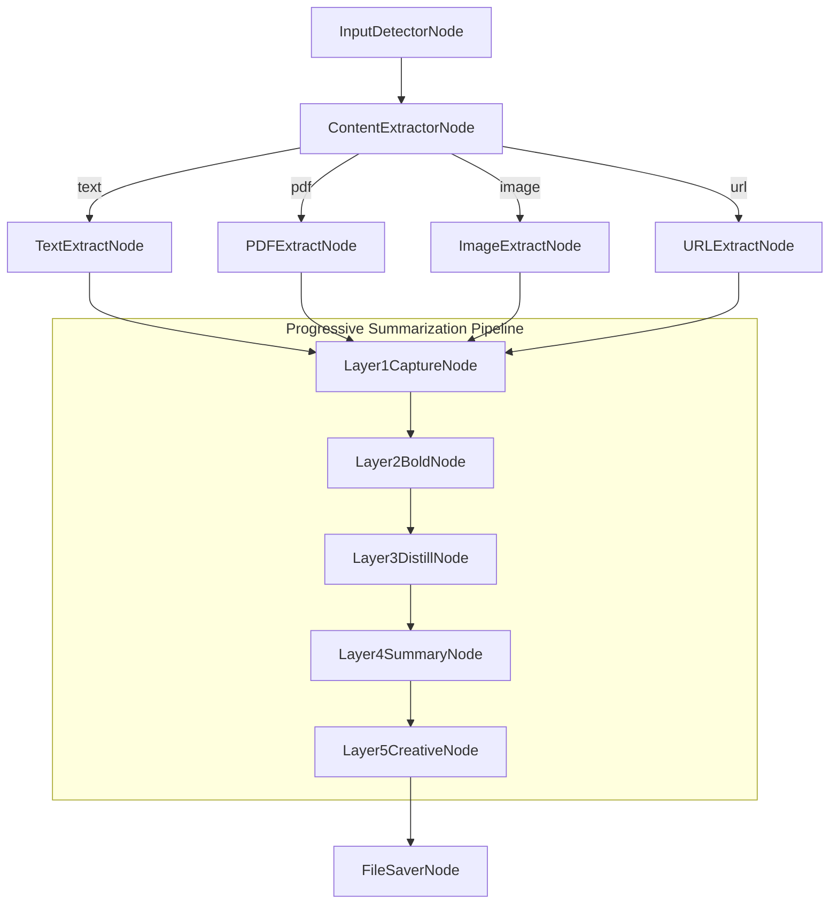
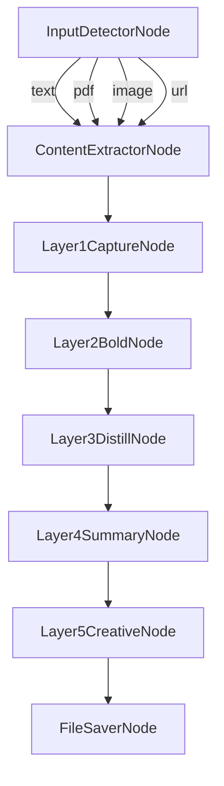

# Design Doc: Progressive Note-Taker Agent

> Please DON'T remove notes for AI

## Requirements

> Notes for AI: Keep it simple and clear.
> If the requirements are abstract, write concrete user stories

1. Accept multiple input types: plain text, PDF file, image file, or valid web URL
2. Automatically detect input type and extract text content
3. Apply Tiago Forte's 5-layer Progressive Summarization method
4. Save each layer as a separate markdown file
5. Follow naming schema: `[timestamp]_[slugified-title]_[level-*].md`
6. Preserve source metadata throughout processing
7. Support optional focus area and output format preferences

**User Stories:**

- As a user, I want to provide any content source (text, PDF, image, URL) and have it automatically processed
- As a user, I want my notes progressively refined from full capture to creative output
- As a user, I want each layer saved separately so I can access any level of detail
- As a user, I want consistent file naming so notes are organized chronologically
- As a user, I want the final layer to add original value beyond summarization

## Technology Stack

- **Node.js**: Runtime environment (>=18.0.0)
- **TypeScript**: Programming language
- **PocketFlow**: Framework for agentic workflow orchestration
- **LLM Provider**: User-configured (OpenAI, Anthropic, etc.)
- **pdf-parse**: PDF text extraction
- **sharp/tesseract.js**: Image OCR (optional)
- **node-fetch**: Web content fetching

## Flow Design

> Notes for AI:
>
> 1. Consider the design patterns of agent, map-reduce, rag, and workflow. Apply them if they fit.
> 2. Present a concise, high-level description of the workflow.

### Applicable Design Patterns:

1. **Workflow Pattern**: The 5-layer summarization is a clear sequential pipeline where each layer depends on the previous
2. **Agent Pattern**: Input detection requires dynamic routing based on content type

### Flow High-Level Design:



### Simplified Flow (Single Extractor with Routing):



## Utility Functions

> Notes for AI:
>
> 1. Understand the utility function definition thoroughly by reviewing the doc.
> 2. Include only the necessary utility functions, based on nodes in the flow.

### 1. LLM Wrapper (`src/utils/llm.ts`)

- _Input_: prompt (string), options (temperature, maxTokens)
- _Output_: response (string)
- _Implementation_: Configurable LLM provider wrapper
- Used by all Layer nodes for summarization

### 2. Content Extractors (`src/utils/extractors.ts`)

- **extractFromText**: Pass-through for plain text
- **extractFromPDF**: Uses pdf-parse library
- **extractFromImage**: Uses OCR (tesseract.js or cloud API)
- **extractFromURL**: Fetches and parses HTML to markdown

### 3. File Operations (`src/utils/files.ts`)

- **slugify**: Convert title to URL-safe slug
- **generateTimestamp**: ISO timestamp for filenames
- **saveLayer**: Write markdown file with proper naming
- _Naming Pattern_: `[YYYYMMDD-HHmmss]_[slugified-title]_level-[1-5].md`

### 4. YAML Parser (`src/utils/yaml.ts`)

- _Input_: LLM response with YAML block
- _Output_: Parsed object
- Used for structured LLM responses in agent decisions

## Node Design

### Shared Memory

> Notes for AI: Try to minimize data redundancy

```typescript
interface SharedState {
  // Input Configuration
  input: {
    raw: string;              // Original input (text, path, or URL)
    type: 'text' | 'pdf' | 'image' | 'url';
    focusArea?: string;       // Optional lens for processing
    outputFormat?: string;    // Preferred Layer 5 format
  };

  // Source Metadata
  metadata: {
    title: string;
    author?: string;
    date?: string;
    sourceType: string;
    wordCount: number;
  };

  // Extracted Content
  content: {
    raw: string;              // Full extracted text
    sections?: string[];      // Natural section breaks
  };

  // Progressive Layers (each populated as processed)
  layers: {
    layer1?: string;          // Initial Capture
    layer2?: string;          // Bold Emphasis
    layer3?: string;          // Distilled Insights
    layer4?: string;          // Executive Summary
    layer5?: string;          // Creative Output
  };

  // Output Configuration
  output: {
    directory: string;        // Output folder path
    timestamp: string;        // Generated timestamp
    slug: string;             // Slugified title
    savedFiles: string[];     // Paths to saved files
  };
}
```

### Node Steps

> Notes for AI: Carefully decide whether to use Batch/Async Node/Flow.

---

#### 1. InputDetectorNode

- _Purpose_: Detect input type and validate input
- _Type_: Regular Node
- _Steps_:
  - **prep**: Read raw input from shared.input.raw
  - **exec**: Analyze input pattern:
    - URL pattern (http/https) → 'url'
    - File extension .pdf → 'pdf'
    - File extension .png/.jpg/.jpeg/.gif → 'image'
    - Otherwise → 'text'
  - **post**: Write detected type to shared.input.type, return type as action

---

#### 2. ContentExtractorNode

- _Purpose_: Extract text content based on input type
- _Type_: Regular Node
- _Steps_:
  - **prep**: Read input.raw and input.type from shared
  - **exec**: Based on type, call appropriate extractor:
    - text: Return as-is
    - pdf: Call extractFromPDF()
    - image: Call extractFromImage()
    - url: Call extractFromURL()
  - **post**:
    - Write extracted text to shared.content.raw
    - Extract/generate metadata (title, word count)
    - Initialize output.timestamp and output.slug
    - Return "default" action

---

#### 3. Layer1CaptureNode

- _Purpose_: Create initial resonance-based capture
- _Type_: Regular Node (with LLM call)
- _Steps_:
  - **prep**: Read content.raw, metadata, and optional focusArea
  - **exec**: Call LLM with Layer 1 prompt:
    ```
    Apply resonance-based selection to this content.
    Select passages that feel potentially useful, surprising, or insightful.
    Preserve original language and natural section breaks.

    Content: {content}
    Focus Area: {focusArea || 'general'}

    Return the captured content with source metadata header.
    ```
  - **post**: Write result to shared.layers.layer1, return "default"

---

#### 4. Layer2BoldNode

- _Purpose_: Add bold emphasis to key passages (20-30%)
- _Type_: Regular Node (with LLM call)
- _Steps_:
  - **prep**: Read layers.layer1
  - **exec**: Call LLM with Layer 2 prompt:
    ```
    Take this Layer 1 capture and add **bold formatting** to the most important 20-30% of text.

    Selection criteria:
    - Core arguments and key claims
    - Memorable examples
    - High-information-density sentences
    - Keywords that serve as memory hooks

    The bolded portions should form a coherent narrative when read alone.

    Layer 1 Content:
    {layer1}
    ```
  - **post**: Write result to shared.layers.layer2, return "default"

---

#### 5. Layer3DistillNode

- _Purpose_: Distill to essential insights (10-15% of original)
- _Type_: Regular Node (with LLM call)
- _Steps_:
  - **prep**: Read layers.layer2 and metadata.wordCount
  - **exec**: Call LLM with Layer 3 prompt:
    ```
    Distill this Layer 2 content to its essential insights.
    Target: 10-15% of original content ({targetWords} words)

    Structure with headers:
    - Core Concepts
    - Key Findings
    - Actionable Principles

    This should be scannable in 10-20 seconds.

    Layer 2 Content:
    {layer2}
    ```
  - **post**: Write result to shared.layers.layer3, return "default"

---

#### 6. Layer4SummaryNode

- _Purpose_: Create executive summary in first-person voice
- _Type_: Regular Node (with LLM call)
- _Steps_:
  - **prep**: Read layers.layer3 and metadata
  - **exec**: Call LLM with Layer 4 prompt:
    ```
    Create an executive summary in first-person perspective.
    Maximum 250 words.

    Structure:
    - The Big Idea (1-2 sentences)
    - What This Means (personal interpretation)
    - Three Key Takeaways (bulleted)
    - Next Actions (specific applications)

    Transform concepts into the reader's mental models.

    Layer 3 Insights:
    {layer3}

    Original Title: {title}
    ```
  - **post**: Write result to shared.layers.layer4, return "default"

---

#### 7. Layer5CreativeNode

- _Purpose_: Transform insights into creative output
- _Type_: Regular Node (with LLM call)
- _Steps_:
  - **prep**: Read layers.layer3, layers.layer4, metadata, and input.outputFormat
  - **exec**: Call LLM with Layer 5 prompt:
    ```
    Transform these insights into a creative output.

    Requested format: {outputFormat || 'auto-detect'}

    If auto-detect, choose based on content type:
    - Technical → Implementation checklist
    - Conceptual → Visual framework (Mermaid diagram)
    - Process → Step-by-step guide
    - Research → Article outline

    Add original value: new examples, connections, applications.

    Layer 3 Insights:
    {layer3}

    Layer 4 Summary:
    {layer4}
    ```
  - **post**: Write result to shared.layers.layer5, return "default"

---

#### 8. FileSaverNode

- _Purpose_: Save all layers as separate markdown files
- _Type_: BatchNode (iterates over 5 layers)
- _Steps_:
  - **prep**: Return array of layer entries:
    ```typescript
    [
      { level: 1, content: shared.layers.layer1, title: 'Initial Capture' },
      { level: 2, content: shared.layers.layer2, title: 'Key Passages' },
      { level: 3, content: shared.layers.layer3, title: 'Distilled Insights' },
      { level: 4, content: shared.layers.layer4, title: 'Executive Summary' },
      { level: 5, content: shared.layers.layer5, title: 'Creative Output' }
    ]
    ```
  - **exec**: For each layer, generate filename and save:
    - Filename: `{timestamp}_{slug}_level-{level}.md`
    - Add header with layer title and metadata
  - **post**: Collect all saved file paths to shared.output.savedFiles

---

## Flow Connection Code

```typescript
// Create nodes
const inputDetector = new InputDetectorNode();
const contentExtractor = new ContentExtractorNode();
const layer1 = new Layer1CaptureNode();
const layer2 = new Layer2BoldNode();
const layer3 = new Layer3DistillNode();
const layer4 = new Layer4SummaryNode();
const layer5 = new Layer5CreativeNode();
const fileSaver = new FileSaverNode();

// Connect flow (all input types route to same extractor)
inputDetector.on('text', contentExtractor);
inputDetector.on('pdf', contentExtractor);
inputDetector.on('image', contentExtractor);
inputDetector.on('url', contentExtractor);

// Sequential pipeline
contentExtractor.next(layer1);
layer1.next(layer2);
layer2.next(layer3);
layer3.next(layer4);
layer4.next(layer5);
layer5.next(fileSaver);

// Create and export flow
const progressiveNoteFlow = new Flow(inputDetector);
```

## Error Handling

- **ContentExtractorNode**: Fallback for failed extraction (empty content warning)
- **Layer Nodes**: Retry up to 3 times with 2-second wait for LLM failures
- **FileSaverNode**: Create output directory if not exists, handle write errors

## Configuration

```typescript
interface Config {
  llm: {
    provider: 'openai' | 'anthropic' | 'ollama';
    model: string;
    apiKey?: string;
    baseUrl?: string;
  };
  output: {
    directory: string;  // Default: './data/notes'
  };
  processing: {
    maxRetries: number; // Default: 3
    retryWait: number;  // Default: 2 (seconds)
  };
}
```

## File Output Example

For input about "Atomic Habits by James Clear":

```
data/notes/
├── 20240115-143022_atomic-habits_level-1.md
├── 20240115-143022_atomic-habits_level-2.md
├── 20240115-143022_atomic-habits_level-3.md
├── 20240115-143022_atomic-habits_level-4.md
└── 20240115-143022_atomic-habits_level-5.md
```

Each file contains:
```markdown
---
title: "Atomic Habits"
layer: 1
layer_name: "Initial Capture"
source: "text"
created: "2024-01-15T14:30:22Z"
word_count: 2500
---

# L1: Atomic Habits - Initial Capture

[Content...]
```
